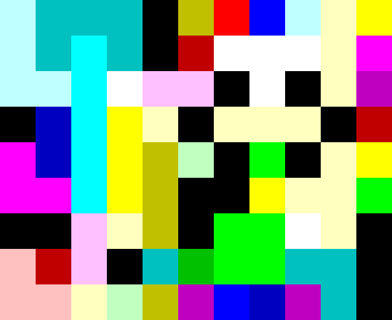

# piet

The programming language [Piet] is for creating abstract art that can function as a program.  Piet programs are images,
where each codel (square group of pixels) has a meaning depending on transitions to its neighbours.  There is also an
ASCII implementation, but developing with this is obviously less exciting.

You can find a great editor on [piet.bubbler.one], thanks Bubbler-4!

## Example program

[][run-anderium]

```ascii-piet
sccc flisvn
sckc d???vm
ssk?uu ? ve
 aknv vvv d
maknfr j vn
mmknf  nvvj
  uvf jj?v
tdu cbjjcc
ttvrfeiaec
```

## Golfing

Golfing refers to the process of writing code that minimises the number of characters in the solution.  It's a common
hobby for people programming in weird languages, and pretty fun to try.  For this language, there aren't technically
characters, only pixels, but there are multiple things golfing can mean.  Firstly you can try to minimise the area of
the program.  Secondly, you can try to minimise the number of characters in the [ascii-piet] translation.  I believe in
both cases, your best option is to have a wide program with very little height.  (The minimum height is 2, but 3 can be
better depending on the loop.)

I tried to minimise the example program above, and as a consequence the middle 3×1 dark yellow is used 3 distinct times.
The first two cyan blocks are also used twice!  I have a simpler example on [CodeGolf stackexchange][double speak] with
an explanation how it works as well.

[ascii-piet]: https://github.com/dloscutoff/ascii-piet
[double speak]: https://codegolf.stackexchange.com/a/254811/89860
[Piet]: https://www.dangermouse.net/esoteric/piet.html
[piet.bubbler.one]: https://piet.bubbler.one/
[run-anderium]: https://piet.bubbler.one/#eJw9j90KgzAMhd8l10cwdtrWVxEvhutAcJvgdjV89yVtuhJCer78fml53RKN0-TAfbUIdhjALUSFn1ForLADh2pgztwpDuhRUkL2YC3WaBDsVciqBZ1C_kOHTmUr9Qa5QlWtCYK1jTrOYEDdKAptdc2yi_hLoXZexpKg86TU66WyhAYZz6Aj7TRS0zQE2taHxNzKk186Fhrv1-1IoPW5f97C6PwBdbJG8A
